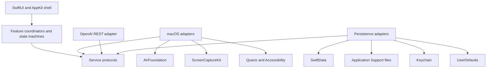
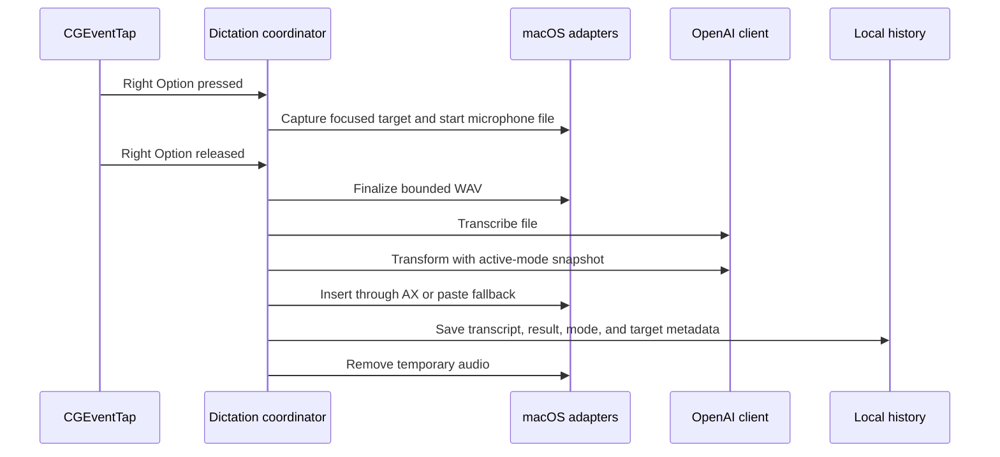
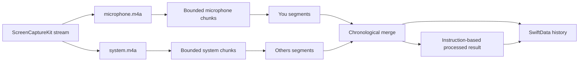

# Whisper System Architecture

- Status: Accepted for the personal MVP
- Target: Apple Silicon, macOS 15 or newer
- Distribution: unsandboxed, ad-hoc signed local application

## Architectural goals

- Deliver push-to-talk dictation into the application that was focused before Whisper appeared.
- Support unlimited custom modes through stored instructions rather than feature-specific translation code.
- Capture microphone and system audio as separate, durable meeting tracks.
- Keep metadata and audio local except for bounded files and text intentionally sent to OpenAI.
- Make network processing cancellable, testable without live requests, and resumable after failure.
- Keep macOS framework details behind protocol boundaries and pure state machines.

## Component zones

### Application shell

`WhisperApp` and its AppDelegate compose dependencies, own the menu-bar item and main window, and present nonactivating HUD panels. UI reads view state and sends user intent to coordinators; it does not call macOS capture or OpenAI APIs directly.

### Core domain

Domain values define modes, shortcuts, settings, history snapshots, transcript segments, errors, and lifecycle states. Pure state machines enforce one active dictation, one active meeting, shortcut transitions, legal status changes, and recovery decisions.

### Feature coordinators

- Dictation coordinates focus capture, microphone recording, transcription, mode transformation, insertion, history, and temporary-file cleanup.
- Meetings coordinate dual-source capture, durable status transitions, chunk planning, transcription merge, final processing, and recovery.
- Settings and onboarding coordinate Keychain, devices, permissions, shortcuts, launch at login, and retention.

Coordinators depend on protocols. Concrete adapters are injected at the application composition root, while tests use fakes.

### Platform and service adapters

- AVAudioEngine records short microphone dictation to a temporary WAV file.
- ScreenCaptureKit supplies separate system-audio and microphone sample buffers for meetings.
- CGEventTap supplies global physical keyboard transitions.
- Accessibility and CGEvent adapters capture focus and insert or paste text.
- URLSession performs direct OpenAI REST requests.
- SwiftData stores metadata; FileManager owns paths and audio files; Keychain stores the API key; UserDefaults stores preferences.

## Dictation flow

The active mode is snapshotted before transformation so later edits do not change history. Silence and cancellation stop before network work. During a meeting, push to talk is rejected without disturbing the capture.

## Meeting flow

Each source writes continuously to disk. A meeting becomes `captured` only after both writers finalize. If one writer fails, the surviving writer is finalized and its path plus the missing source are persisted in a failed or interrupted meeting record before the error reaches the UI. Chunk transcription and result processing are durable follow-up jobs; their state and source paths survive relaunch. The two complete tracks establish You/Others attribution but do not identify individual remote speakers.

## Storage ownership

| Data | Owner | Lifetime |
|---|---|---|
| OpenAI API key | Keychain | Until replaced or removed |
| Modes, history, jobs, transcript segments | SwiftData | Until confirmed deletion or retention cleanup |
| File-cleanup tombstones | SwiftData | Until the referenced meeting directory is removed |
| Meeting source audio | Application Support | Until confirmed deletion or retention cleanup |
| Retry chunks | Application Support | Until the corresponding transcript is persisted |
| Active dictation WAV | Application Support temporary area | Until success, cancellation, or handled failure cleanup |
| User preferences | UserDefaults | Until changed or app data is removed |

Paths stored in SwiftData are relative to the Whisper Application Support root. File services reject traversal outside that root. Confirmed meeting deletion transactionally removes the history record and creates a cleanup tombstone with the validated relative directory path. The file service removes only that directory and deletes the tombstone after success; startup recovery retries surviving tombstones.

## Concurrency and durability

- UI state and SwiftData ModelContext access are MainActor-isolated.
- Audio callbacks perform bounded work on dedicated serial queues and hand normalized events to actors.
- Event-tap callbacks immediately forward normalized events and never run feature work.
- URLSession requests and processing jobs support cancellation.
- Recording writers are finalized before a complete or partial capture result is persisted.
- Startup recovery queries captured, transcribing, and processing meetings and resumes only the missing stage.

## Permission and failure boundaries

Microphone gates dictation and the local meeting track. Screen Recording gates system-audio capture. Accessibility gates global event monitoring and direct insertion. Missing permissions disable only dependent actions; History and mode editing remain available.

Clipboard fallback distinguishes posting Command-V events from confirming target consumption, which CGEvent does not expose. After posting, restoration waits for the bounded paste delay and is best effort. If event construction or posting cannot proceed, the final text remains on the clipboard for manual paste.

Network, authentication, rate-limit, and server failures never delete captured meeting audio. Invalid credentials stop without retry. Transient failures use bounded backoff and expose retry. Partial capture persists the missing source and every finalized track path so recovery and deletion retain a durable owner.

## Privacy rules

- Never log the API key, Authorization header, dictated text, transcript text, custom instructions, or recording instructions.
- Read the key from Keychain immediately before a request.
- Send only the bounded audio or text needed for the selected operation.
- Disable OpenAI response storage where the endpoint supports it.
- Keep source audio local except for chunks explicitly uploaded for transcription.
- Use sanitized fixtures and protocol fakes in automated tests.

## Decision index

1. [Use XcodeGen for project generation](adr/0001-use-xcodegen-for-project-generation.md)
2. [Ship an unsandboxed ad-hoc build](adr/0002-ship-an-unsandboxed-ad-hoc-build.md)
3. [Separate metadata and audio storage](adr/0003-separate-metadata-and-audio-storage.md)
4. [Use direct OpenAI REST transport](adr/0004-use-direct-openai-rest-transport.md)
5. [Capture meetings with ScreenCaptureKit](adr/0005-capture-meetings-with-screencapturekit.md)
6. [Monitor global shortcuts with CGEventTap](adr/0006-monitor-global-shortcuts-with-cgeventtap.md)
7. [Insert text through Accessibility with paste fallback](adr/0007-insert-text-through-accessibility-with-paste-fallback.md)

## Dependency rule

Dependencies point inward: UI and platform adapters depend on protocol and domain definitions, while domain code imports neither UI nor concrete macOS services. New providers, cloud synchronization, local speech models, and app-specific mode activation remain outside the MVP.

## Sources

- [Approved product specification](../superpowers/specs/2026-08-19-whisper-macos-mvp-design.md)
- [Implementation plan](../superpowers/plans/2026-08-19-whisper-macos-mvp.md)
